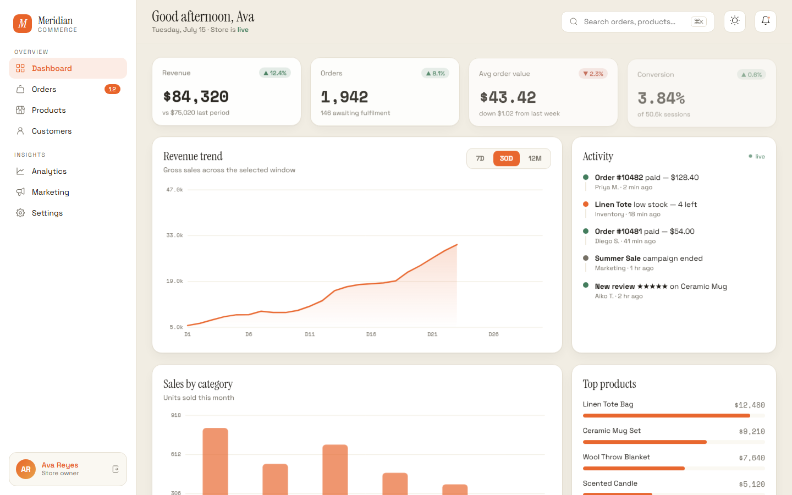
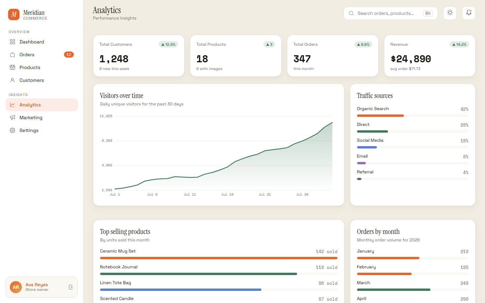
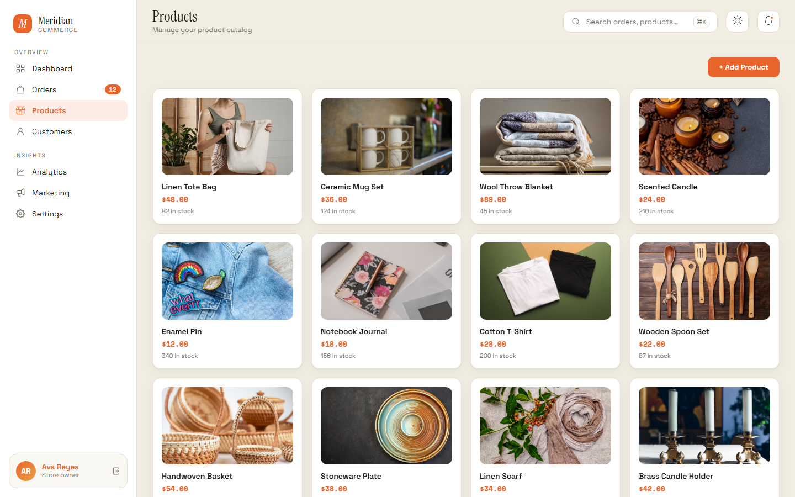

# Meridian Commerce — Admin Dashboard

A modern, responsive admin dashboard for e-commerce store management built with the DC framework. Clean design, light/dark themes, interactive charts, and full CRUD-style interactions — all in plain HTML/CSS/JS with no build step.

## Screenshots

### Dashboard


### Analytics


### Products


## Features

- **Dashboard** — KPI cards, revenue trend chart, sales by category, activity feed, top products
- **Orders** — Paginated order table with new order modal (32 orders)
- **Products** — 18 products with images, edit/delete dropdowns, add product modal
- **Customers** — Paginated customer list with customer modal (20 customers, 8 per page)
- **Analytics** — Visitors chart, traffic sources, top selling products, orders by month
- **Marketing** — Campaign management with create campaign modal
- **Settings** — Store configuration form
- **Account** — User profile editing
- **Theming** — Light/dark mode toggle with persistence (applied before first paint, no flash)

## Tech Stack

- **DC Framework** — custom component system (`support.js`)
- **CSS custom properties** — theme tokens in `styles.css`
- **Iconoir** — icon library
- **Canvas API** — hand-drawn charts, no chart library
- **Vanilla JS** — pagination, modals, dropdowns, theme toggle (`theme.js`)

## Pages

| Page      | File                      |
|-----------|---------------------------|
| Dashboard | `Commerce Console.dc.html` |
| Orders    | `orders.html`             |
| Products  | `products.html`           |
| Customers | `customers.html`          |
| Analytics | `analytics.html`          |
| Marketing | `marketing.html`          |
| Settings  | `settings.html`           |
| Account   | `account.html`            |

## Getting Started

No build step or dependencies — just open any HTML file in a browser:

```bash
# start from the dashboard
start "Commerce Console.dc.html"   # Windows
open "Commerce Console.dc.html"    # macOS
```

The DC framework loads automatically from `support.js`, and `theme.js` restores the saved theme before paint.

## Project Structure

```
├── Commerce Console.dc.html   # Dashboard (main page)
├── orders.html / products.html / customers.html
├── analytics.html / marketing.html / settings.html / account.html
├── styles.css                 # Theme tokens + shared styles
├── theme.js                   # Theme persistence (loaded first)
├── support.js                 # DC framework runtime
├── Assets/                    # Product images
└── screenshots/               # README screenshots
```

## License

MIT License — see [LICENSE](LICENSE) for details.
